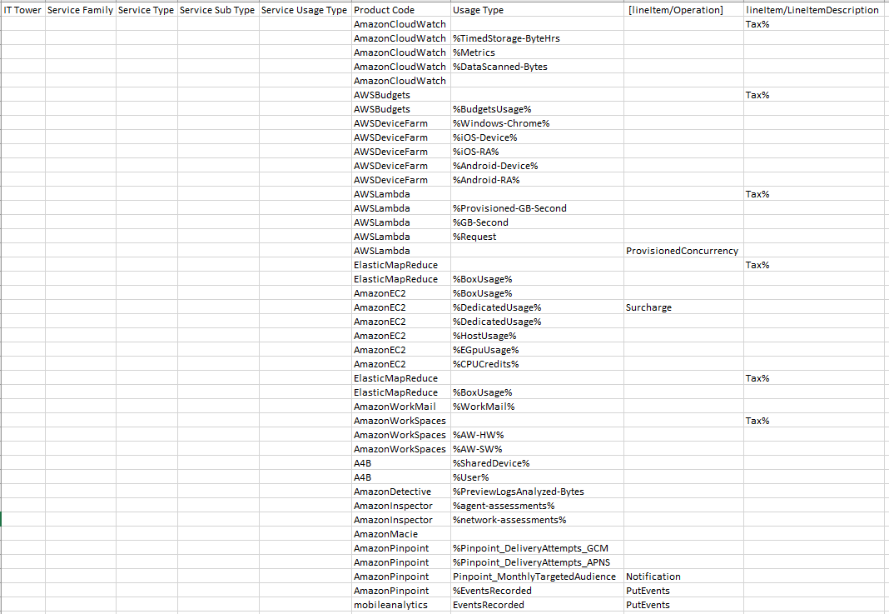
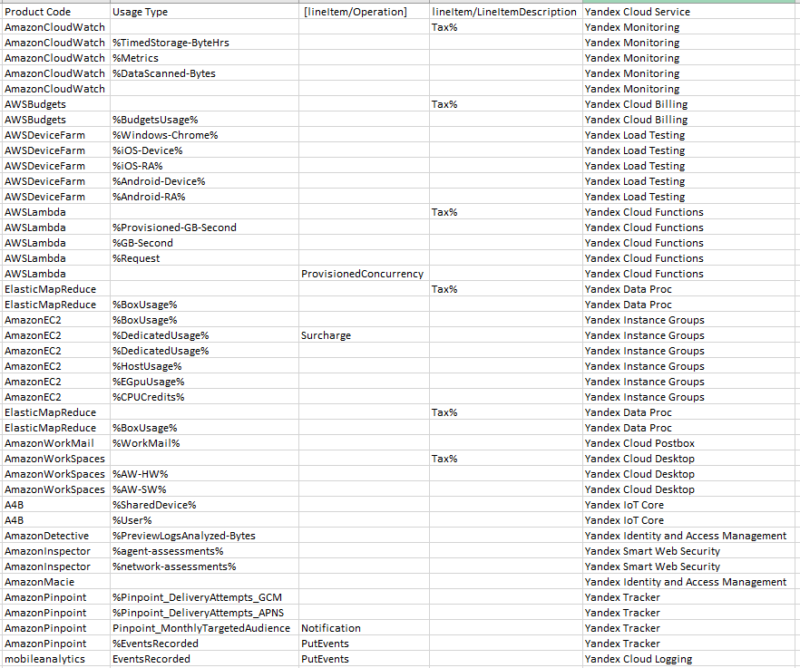

# Аналитическая работа №1 - Знакомство с облачными сервисами Amazon AWS
## Состав команды: 
- Бакланова Анастасия;
- Борисов Игнат;
- Крылов Дан;
- Улитина Мария.
## Цель работы: 
Знакомство с облачными сервисами. Понимание уровней абстракции над инфраструктурой в облаке. Формирование понимания типов потребления сервисов в сервисной-модели.
## Дано: 
1. Слепок данных биллинга от провайдера после небольшой обработки в виде SQL-параметров. Символ % в начале/конце означает, что перед/после него может стоять любой набор символов.
2. Google с документациями провайдера.
## Необходимо: 
1. Импортировать файл .csv в Excel или любую другую программу работы с таблицами;
2. Определить соответствие каждого сервиса международного провайдера русскому сервису.
## Начальные данные: 

 Проанализировав слепок данных и изучив сервисы Amazon AWS, нашей командой были подобраны аналоги среди сервисов Yandex Cloud. Сервисы этой компании были выбраны по той причине, что компания Yandex является одной из самых крупных и известных в России и обладает наиболее продвинутыми облачными сервисами в России.
 
 Несмотря на то, что компания Amazon является в разы более крупной компанией (согласно отчётам этих компаний, в Yandex работает около 25 тысяч человек, а в Amazon больше полутора миллионов), всем сервисам Amazon AWS удалось найти альтернативы в Yandex Cloud.

## Cервисы Amazon AWS и их аналоги среди сервисов Yandex Cloud:

**AmazonCloudWatch** - это сервис мониторинга и управления, который предоставляет ценные с практической точки зрения данные об AWS, гибридных, локальных и других облачных приложениях, а также ресурсах инфраструктуры. CloudWatch предоставляет полезную информацию, которая позволяет оптимизировать производительность приложений, управлять использованием ресурсов и оценивать работоспособность системы в целом. CloudWatch обновляет метрики и данные журналов с интервалом в одну секунду, обеспечивает хранение данных (метрик) в течение 15 месяцев и дает возможность выполнять расчеты с использованием метрик. Аналитику контейнеров CloudWatch можно использовать для настройки оповещений, мониторинга контейнерных приложений и микросервисов, а также устранения неполадок в них. CloudWatch собирает, хранит и обобщает данные об использовании процессора, памяти, диска и сети, а также диагностическую информацию, например о сбоях при перезапуске контейнера, чтобы помочь инженерам DevOps находить проблемы и быстро устранять их.

**Yandex Monitoring** - это полный аналог решения от Amazon: этот сервис от компании Yandex так же позволяет автоматически собирать и отслеживать метрики и устанавливать инструкции на случай необычных изменений в них. Позволяет создать отдельный график на базе нескольких метрик или собрать все метрики вашего приложения на одном дашборде. Сервис поддерживает REST API. Пользователи могут изуализировать выгруженные метрики и отслеживайте состояние облачной и локальной инфраструктуры в одной системе.

##
**AWSBudgets** - это сервис для облегчения управления расходами сервисов AWS. В нём можно отслеживать текущие расходы, устанавливать ограничения на максимальные траты, устанавливать строго определённые бюджеты для различных сервисов и получать уведомления (предупреждения), если некий сервис начал тратить бюджет не так, как задумано.

Существуют следующие виды AWSBudgets:

**Cost budgets** – Планирование, сколько вы хотите потратить на услугу.

**Usage budgets** – Планирование, сколько вы хотите использовать одну или несколько услуг.

**RI utilization budgets** – Определение порог использования и получайте оповещения, когда использование RI падает ниже этого порога. Это позволит вам увидеть, не используются ли ваши зарезервированные инстансы или используются ли они недостаточно.

**RI coverage budgets** – Определение порог покрытия и получайте оповещения, когда количество часов вашего экземпляра, покрываемых зарезервированными инстансами, упадет ниже этого порога. Это позволяет вам увидеть, какая часть использования вашего экземпляра покрывается резервированием.

**Savings Plans utilization budgets** – Определение порог использования и получайте оповещения, когда использование ваших планов сбережений упадет ниже этого порога. Это позволяет вам увидеть, не используются ли ваши планы сбережений или используются ли они недостаточно.

**Savings Plans coverage budgets** – Определение порог покрытия и получайте оповещения, когда использование ваших планов сбережений, подпадающее под действие планов сбережений и покрываемое планами сбережений, упадет ниже этого порога. Это позволяет вам увидеть, какая часть использования вашего экземпляра покрывается планами экономии.

**Yandex Cloud Billing** — как и в случае с парой "AmazonCloudWatch - Yandex Monitoring", данный продукт компании Yandex является аналогом соответствующего сервиса от Amazon AWS, однако сервис от Yandex больше настроен на действия со средствами, нежели с планированием. Также стоит заметить, что сервис от Yandex позволяет работать не с экосистемой Amazon AWS, а экосистемой Yandex Cloud.

##
**AWSDeviceFarm** - это служба тестирования приложений, которую используют для тестирования и взаимодействия с вашими Android, iOS и веб-приложениями на реальных физических телефонах и планшетах, размещенных на Amazon Web Services (AWS), позволяя отлаживать приложения без необходимости компании-пользователя закупать многие тысячи различных видов гаджетов.

Существует два основных способа использования Device Farm: Автоматизированное тестирование приложений с использованием различных платформ тестирования; Удаленный доступ к устройствам, на которые вы можете загружать, запускать приложения и взаимодействовать с ними в режиме реального времени.

По причине того, что компания Yandex в разы меньше и беднее, чем компания Amazon, она не может позволить себе сервис по типу AWSDeviceFarm. Однако, компания Yandex имеет свой сервис для тестирования приложений, сетевых ресурсов и других сервисов, а именно **Yandex Load Testing**. С помощью данного сервиса можно без труда определить, как поведёт себя приложение под большой нагрузкой, симулируя наплыв пользователей или даже DDoS-атаку.

##
**AWSLambda**- сервис для бессерверных расчётов, то есть расчётов без необходимости компании-пользователю следить за различными метриками и перегрузкой или простоем сервера: с помощью данного сервиса можно выполнять именно тот объём работ, что был запрошен, без необходимости точно настраивать ресурсы сервера.
Lambda используется для:

- Обработка файлов: используйте Amazon Simple Storage Service (Amazon S3), чтобы запускать обработку данных Lambda в реальном времени после загрузки.

- Потоковая обработка: используйте Lambda и Amazon Kinesis для обработки потоковых данных в реальном времени для отслеживания активности приложений, обработки заказов транзакций, анализа потока посещений, очистки данных, фильтрации журналов, индексирования, анализа социальных сетей, телеметрии данных устройств Интернета вещей (IoT) и замер.

- Веб-приложения. Объедините Lambda с другими сервисами AWS для создания мощных веб-приложений, которые автоматически масштабируются вверх и вниз и работают в конфигурации высокой доступности в нескольких центрах обработки данных.

- Серверные части Интернета вещей: создавайте бессерверные серверные части с помощью Lambda для обработки веб-, мобильных, IoT-запросов и запросов сторонних API.

- Мобильные серверные части: создавайте серверные части с помощью Lambda и Amazon API Gateway для аутентификации и обработки запросов API. Используйте AWS Amplify для простой интеграции с вашими интерфейсами iOS, Android, веб-интерфейсами и React Native.
**Yandex Cloud Functions** — это полный аналог AWSLambda, то есть сервис для бессерверных расчётов. Он так же позволяет запускать свой собственный код без каких-либо трат времени и сил на настройку сервера, поскольку эта задача целиком ложится на плечи автоматики Yandex Cloud.

##
**ElasticMapReduce** - это сервис для обработки так называемых "больших данных", то есть огромного количества различных данных, которые можно эффективно обработать с помощью масштабируемых программных инструментов.

**Yandex Data Proc** - это полный аналог ElasticMapReduce, и он точно так же позволяет выполнять различные операции над "большими данными" без соразмерных, то есть невероятно больших, затрат.

##
**AmazonEC2** - это сервис для выделения виртуальных серверов пользователю. По сути, пользователь получает себе во владение за скромную плату невероятно мощный компьютер, платить за который надо лишь в том случае, если ты его используешь (это один из методов оплаты данного сервиса, "pay-as-you-go"). Не стоит забывать, правда, что если не ограничить бюджет, а на вашем сервере произойдёт какая-нибудь страшная ошибка, которая начнёт экспоненциально увеличивать траты ресурсов, то подобная схема оплаты может быстро превратить вашу компанию в банкрота, так что с данным методом оплаты следует быть осторожным.

**Yandex Instance Groups** - это аналог AmazonEC2, то есть сервис, позволяющий пользователю выделять себе виртуальные сервера для самых различных задач. В данном случае, однако, сервера данного сервиса больше предназначены для небольших и узкоспециализированных задач, нежели обширных и универсальных.

##
**AmazonWorkMail** - это служба защищённой корпоративной почты, позволяющая легко управлять различными аспектами вашей компании с точки зрения рассылки информации, расширения и особенно безопасности.

**Yandex Cloud Postbox** - на данный момент этот сервис находится в разработке и в нём доступны только транзакционные email-сообщения, однако в будущем компания Yandex рассчитывает, что данный сервис так же вырастет до полноценной корпоративной почты.

##
**AmazonWorkSpaces** - это инструмент для совместной работы на самых различных операционных системах и конфигурациях, открывая для разработчиков возможность работать на одной и той же машине удалённо, что сильно ускоряет коммуникацию между разработчиками и облегчает взаимодействие между ними.

**Yandex Cloud Desktop** - этот инструмент компании Yandex на данный момент находится в стадии Preview, то есть он невероятно свеж и ещё недоработан, но он является аналогом сервиса AmazonWorkSpaces, то есть так же позволяет создавать в облаке удалённые рабочие места для сотрудников.

##
**A4B** - это **Alexa for Business**, то есть сервис, позволяющий добавить в рабочую среду виртуального ассистента Alexa для повышения производительности.

Несмотря на то, что у компании Yandex нет специализированного голосового помощника для бизнеса, у неё есть универсальный, а именно **Yandex Alice**. С его помощью можно выполнять самые разные задачи, которые могут потребоваться разработчику для повышения производительности.

##
**AmazonDetective** - это сервис, позволяющий исследовать и анализировать проблемы с безопасностью в рабочей среде. Он позволяет автоматически собирать информацию из различных сервисов и использует машинное обучение, чтобы понять, где именно возможна атака недоброжелателей на компанию-пользователя и как её избежать.

У компании Yandex есть аналог данного сервиса Amazon для управления безопасностью, однако, он значительно более простой и управляется живыми сотрудниками, а не нейросетью. Это **Yandex Identity and Access Management**. Данный сервис служит для управления доступом различных пользователей к тем или иным сервисам Yandex CLoud и ограничения для них тех или иных прав, например, просмотр логов о данных сервера.

##
**AmazonInspector** - этот сервис позволяет отслеживать соблюдение требований безопасности различных приложений, оценивать их уязвимости и автоматически создаёт отчёты, если те или иные бреши в безопасности приложений сервера были обнаружены.

**Yandex Smart Web Security** -  это сервис, как и многие другие среди сервисов Yandex Cloud, на данный момент находится на стадии Preview и пока имеет значительно меньше функций, чем AmazonInspector, однако он уже позволяет отслеживать и прекращать DDoS-атаки на приложения серверов компании-пользователя и защищает её от ботов.

##
**AmazonMacie** - это ещё один сервис от компании Amazon, нацеленный на безопасность. Данный сервис, в отличие от предыдущих, нацелен на данные, хранящиеся в AWS, и отслеживает, чтобы к данным соблюдался строгий доступ и они не могли быть украдены или удалены подозрительными пользователями.

Аналогом данного сервиса выступает описанный ранее **Yandex Identity and Access Management**.

##
**AmazonPinpoint** - это сервис, позволяющий отслеживать использование серверов пользователями, анализирующий использование тех или иных приложений и собирающий аналитику. Данный сервис служит для привлечения новых пользователей и облегчения их взаимодействий с приложением.

У компании Yandex есть похожий сервис, а именно **Yandex Tracker**. Этот сервис позволяет отслеживать взаимодействие с сервером, но он нацелен не на рядовых пользователей, а на разработчиков и сотрудников компании-пользователя.

##
**mobileanalytics** - этот сервис использовался для сбора аналитики с мобильных приложений и визуализации собранных данных, выполнявший схожие функции с AmazonPinpoint, но для приложений. Закономерно, он был встроен в AmazonPinpoint и больше не существует как отдельный сервис.

**Yandex Cloud Logging** — этот сервис компании Yandex собирает аналитику приложений на серверах Yandex Cloud и позволяет проводить подробный анализ действий пользователей с тем или иным приложением.
##

## Выводы о возможностях миграции: 
Проанализировав таблицу, можно сделать вывод, что для сервисов Amazon AWS существуют аналоги в Yandex Cloud, однако функционал некоторых из сервисов Yandex Cloud не является полной копией аналогов из Amazon AWS, хоть они и очень близки по смыслу и задачам. Например, mobileanalytics от компании Amazon был встроен в Amazon Pinpoint, но в Yandex Cloud аналогичные сервисы не объединялись и имеют различные задачи (Yandex Cloud Logging и Yandex Tracker).

Таким образом, мигрировать из Amazon AWS в Yandex Cloud очень даже можно, но некоторые сервисы могут иметь несколько меньший функционал.
