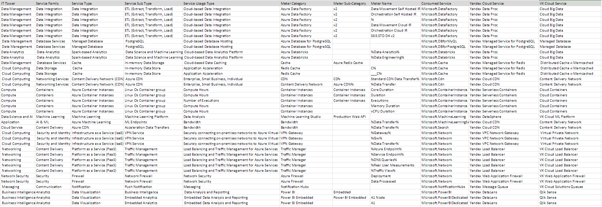

# Аналитическая работа №2 - Знакомство с облачными сервисами Microsoft Azure
## Состав команды: 
- Улитина Мария;
- Бакланова Анастасия;
- Крылов Дан;
- Борисов Игнат.
## Цель работы: 
Знакомство с облачными сервисами. Понимание уровней абстракции над инфраструктурой в облаке. Формирование понимания типов потребления сервисов в сервисной-модели.
## Дано: 
1. Слепок данных биллинга от провайдера после небольшой обработки в виде SQL-параметров. Символ % в начале/конце означает, что перед/после него может стоять любой набор символов.
2. Google с документациями провайдера.
## Необходимо: 
1. Импортировать файл .csv в Excel или любую другую программу работы с таблицами;
2. Определить соответствие каждого сервиса международного провайдера русскому сервису.
## Начальные данные: 

 После анализа слепка данных, и изучив сервисы Microsoft Azure, были подобраны аналоги среди сервисов Yandex Cloud и VK Cloud. Были выбранны данные облачные сервисы, поскольку они являются самыми популярными в использовании на российском рынке. 
 
 Конечно, сервисы Microsoft являются разнообразнее и имеют более широкий функционал в отличие от российских аналогов, однако это не помешало подобрать к каждому из исходного списка аналог из Yandex Cloud и VK Cloud.

## Cервисы Microsoft Azure и их аналоги среди Yandex Cloud Service и VK Cloud Service:

**Azure Data Factory** - это облачная служба ETL Azure для масштабируемой бессерверной интеграции и преобразования данных.  Визуально интегрирует источники данных с помощью более чем 90 встроенных, не требующих обслуживания разъемов без дополнительных затрат. Он предлагает пользовательский интерфейс без кода для интуитивно понятного создания, а также мониторинга и управления с единой панели. Также можно перенести существующие пакеты SSIS в Azure и запустить их с полной совместимостью в ADF. Среда выполнения интеграции SSIS предлагает полностью управляемую услугу, поэтому не придется беспокоиться об управлении инфраструктурой.

**Yandex Data Proc** - Сервис для обработки многотерабайтных массивов данных с использованием инструментов с открытым исходным кодом, таких как Apache Spark™, Apache Hadoop®, Apache HBase®, Apache Hive™, Apache Zeppelin™ и других сервисов экосистемы Apache®.

**VK Cloud Big Data**  — это решения для работы с большими данными на основе Apache Hadoop, Apache Spark, ClickHouse, Storm и Kafka.
##

**Azure Database for PostgreSQL** - это служба реляционной базы данных, основанная на ядре базы данных Postgres с открытым исходным кодом. Это полностью управляемая база данных как услуга, которая может обрабатывать критически важные рабочие нагрузки с предсказуемой производительностью, безопасностью, высокой доступностью и динамической масштабируемостью.

**Yandex Managed Service for PostgreSQL** — это сервис, который помогает вам создавать, эксплуатировать и масштабировать базы данных PostgreSQL в облачной инфраструктуре. Managed Service for PostgreSQL обеспечивает репликацию данных между хостами БД (как внутри, так и между зонами доступности) и автоматически переключает нагрузку на резервную реплику в случае аварии.

**VK Cloud Databases** — облачные базы данных (Database as a service). Сервис позволяет развернуть в облаке решения на основе MySQL, PostgreSQL, MongoDB, Redis, ClickHouse, Postgres Pro,Tarantool, Greenplum. Базы доступны в single, master-slave и кластерных конфигурациях.
##

**Azure Databricks** - это унифицированная открытая аналитическая платформа для создания, развертывания, совместного использования и обслуживания данных, аналитики и решений искусственного интеллекта корпоративного уровня в любом масштабе. Платформа обработки данных Databricks интегрируется с облачным хранилищем и безопасностью вашей облачной учетной записи, а также управляет и развертывает облачную инфраструктуру от вашего имени.

Аналогами выступаю сервисы, представленные выше, а именно: **Yandex Data Proc** и **VK Cloud Big Data**.

##
**Cache**- это аппаратный или программный компонент, который хранит данные, чтобы будущие запросы на эти данные могли обслуживаться быстрее; данные, хранящиеся в кэше, могут быть результатом более ранних вычислений или копией данных, хранящихся в другом месте. 
Попадания в кэш обслуживаются путем чтения данных из кэша, что происходит быстрее, чем повторное вычисление результата или чтение из более медленного хранилища данных; таким образом, чем больше запросов может быть обработано из кеша, тем быстрее работает система.

**Yandex Managed Service for Redis** — сервис кэширования, предоставляемый Yandex Cloud Service, основанный на популярной открытой системе кэширования Redis. Он позволяет временно хранить данные в памяти для быстрого доступа и улучшения производительности приложений. Yandex Managed Service for Redis обеспечивает высокую доступность и отказоустойчивость данных, а также автоматическое масштабирование в зависимости от нагрузки.

**VK Distributed Cache** - это распределенная система кэширования, разработанная для использования в социальной сети ВКонтакте. Он предназначен для хранения и быстрого доступа к данным, таким как профили пользователей, группы, новости и другие объекты, которые часто запрашиваются пользователями. **VK Cloud Memcached** использует технологию Memcached, которая позволяет хранить данные в оперативной памяти серверов для быстрого доступа. Это позволяет снизить нагрузку на основные базы данных и ускорить доступ к данным.

##
**Redis Cache** - это хранилище структур данных в памяти с открытым исходным кодом (лицензия BSD), используемое в качестве базы данных, кэша, брокера сообщений и механизма потоковой передачи. Redis предоставляет такие структуры данных , как строки , хеши , списки , наборы , отсортированные наборы с запросами диапазона, растровые изображения , гиперлоги , геопространственные индексы и потоки . Redis имеет встроенную репликацию , сценарии Lua , вытеснение LRU , транзакции и различные уровни сохранения на дискЕ. 

Аналогами выступаю сервисы, представленные выше, а именно: **Yandex Managed Service for Redis** и **VK Distributed Cache**.

##
**Azure CDN (Content Delivery Network)** - это географически распределенная группа серверов, которые кэшируют контент рядом с конечными пользователями. CDN позволяет быстро передавать ресурсы, необходимые для загрузки интернет-контента, включая HTML-страницы, файлы JavaScript, таблицы стилей, изображения и видео.

**Yandex Cloud CDN** представляет схожий с азуровским функционал. Точно так же с помощью распределения и кэширования происходит снижение нагрузки на основной сервер (ориджин). Всего CDN-ов более 140. Также Яндекс предоставляет инструменты аналитики трафика и запросов.

**VK Content Delivery Network** суть та же, что и в первых двух сервисах.При использовании CDN контент раздается с ближайшего к потребителю CDN-сервера. Если на этом сервере нет нужного контента, то он запрашивается с серверов-источников (origin) или соседних CDN-серверов и кешируется на некоторое время. В сервисе CDN VK Cloud также есть возможность предварительной загрузки контента на CDN-серверы, что дополнительно снижает нагрузку на серверы-источники.
##

**Azure Container Instances** - это служба, которая позволяет разработчику развертывать контейнеры в общедоступном облаке Microsoft Azure без необходимости подготовки какой-либо базовой инфраструктуры или управления ею.
Служба поддерживает как контейнеры Linux, так и контейнеры Windows. Это избавляет разработчика от необходимости предоставлять виртуальные машины ( ВМ ) или внедрять платформу оркестрации контейнеров, такую ​​как Kubernetes , для развертывания и запуска контейнеров. Вместо этого с помощью ACI организация может развернуть новый контейнер через портал Azure или интерфейс командной строки ( CLI ), а Microsoft автоматически подготавливает и масштабирует базовые вычислительные ресурсы. ACI также поддерживает стандартные образы Docker , которые разработчик может получить из реестра контейнеров, например Docker Hub или реестра контейнеров Azure.

**Yandex Serverless Containers** также предоставляет пользователям возможность запускать контейнеры, не управляя серверами и инфраструктурой. Масштабирование приложений автоматическое, оплата происходит только по факту времени использования ресурсов или количеству запусков контейнеров. Также можно сделать возможным допуск контейнера к пользовательским ресурсам в указанной сети, не только из интернета. Из особенностей можно указать поддержку экземпляров контейнеров без холодного старта, что даёт высокую скорость при запуске.

**VK Cloud Containers** схож с Yandex Serverless Containers в плане возможности автоматического масштабирования и оплатой по факту использования ресурсов, без разделения на Standart/Premium. Однако, в отличие от двух предыдущих опций, VK предлагает работу только с Kubernetes. Из преимуществ - много метрик: Графики по ключевым метрикам кластера (Cloud Monitoring), монитлринг доступности, аудит прав доступа, управление защитой и тд.
##

**Machine Learning Studio** - это инструмент для совместной работы с возможностью перетаскивания, который можно использовать для создания, тестирования и развертывания решений прогнозного анализа ваших данных. Machine Learning Studio публикует модели в виде веб-сервисов, которые можно легко использовать с помощью пользовательских приложений или инструментов бизнес-аналитики, таких как Excel.

**Yandex DataSphere** - это многофункциональная платформа, предназначенная для специалистов в области данных и разработчиков, позволяющая эффективно осуществлять разработку, анализ и внедрение данных и моделей машинного обучения в удобной облачной среде. Из особенностей - предоставляется пользовательский интерфейс для работы с данными.

**VK Cloud ML Platform** - это среда, базирующаяся на облаке, которая обеспечивает необходимые ресурсы и инструментарий для создания продвинутых решений на базе машинного обучения. Платформа предназначена для облегчения интеграции и внедрения этих моделей в приложения и системы. Из особенностей здесь есть инструмент для командной разработки и планирования задач и хранение реализовано в российских ЦОДах.
##

**Bandwidth** - это объем данных, которые передаются в ваши ресурсы Azure и из них. Затраты на пропускную способность могут составлять значительную часть вашего общего счета за Azure, но их часто упускают из виду. Под пропускной способностью понимают перемещение данных в центры обработки данных Azure и из них, а также перемещение данных между центрами обработки данных Azure; другие передачи явно покрываются сетью доставки контента, ценами ExpressRoute или пирингом.

Аналогами выступаю сервисы, представленные выше, а именно: **Yandex Cloud CDN** и **VK Content Delivery Network**.
##
**VPN Gateway** - это служба, которая использует определенный тип шлюза виртуальной сети для отправки зашифрованного трафика между виртуальной сетью Azure и локальными расположениями через общедоступный Интернет. Вы также можете использовать VPN-шлюз для отправки зашифрованного трафика между виртуальными сетями Azure через сеть Microsoft. К одному и тому же VPN-шлюзу можно создать несколько подключений. При создании нескольких подключений все VPN-туннели совместно используют доступную пропускную способность шлюза.

**Yandex VPC Network Gateway** служит для управления облачными сетями и связи облачных ресурсов между собой и с интернетом. Virtual Private Cloud позволяет создавать сети, подсети в зонах доступности Yandex Cloud, назначать облачным ресурсам внутренние и публичные IP-адреса, а также предоставляет возможность защиты от DDoS-атак с помощью компонента DDoS-Protection.

**VK  Virtual Private Network** позволяет организовать туннель между одной или несколькими подсетями VK Cloud. Сервис VPN основан на StrongSwan и позволяет организовывать IPsec-туннели.
##
**Traffic Manager** - это балансировщик нагрузки трафика на основе DNS. Эта служба позволяет распределять трафик общедоступных приложений по глобальным регионам Azure. Диспетчер трафика также обеспечивает вашим общедоступным конечным точкам высокую доступность и быстроту реагирования.
Диспетчер трафика использует DNS для направления клиентских запросов к соответствующей конечной точке службы на основе метода маршрутизации трафика. Диспетчер трафика также обеспечивает мониторинг работоспособности каждой конечной точки.

**Yandex Load Balancer** -  это сервис для распределения нагрузки по сервисам и приложениям, развернутым в Yandex Cloud. Application Load Balancer работает на 7-м уровне модели OSI и передает трафик по протоколам HTTP и HTTPS на бэкенды ваших приложений. Распределение нагрузки происходит на основе параметров HTTP-запросов к балансировщику, например, по значениям Host-заголовков или URI. Также Application Load Balancer позволяет обрабатывать TCP-трафик, в том числе снимать с него TLS-шифрование.

**VK Cloud Load Balancer** - балансировщик нагрузки, который автоматически распределяет входящий трафик между серверами. Приложения и сервисы доступны, даже если один из серверов выходит из строя или не может справиться с потоком запросов.
##

**Azure Firewall** - это облачная интеллектуальная служба безопасности сетевого брандмауэра, которая обеспечивает лучшую в своем классе защиту от угроз для ваших облачных рабочих нагрузок, выполняемых в Azure. Это межсетевой экран с полным сохранением состояния как услуга со встроенными функциями высокой доступности и неограниченной облачной масштабируемостью. Он обеспечивает проверку дорожного движения как с востока на запад, так и с севера на юг.

**Yandex Web Application Firewall** - это специализированное средство защиты информации, работающее на прикладном уровне модели OSI, которое защищает от атак, направленных на приложения. WAF — это совокупность фильтров и эвристических механизмов обнаружения и блокировки аномалий и атак на веб-приложение.

**VK Web Application Firewall** - управление правилами для предотвращения интернет-угроз, включая IP-адреса, заголовки и тело HTTP, строки URL, межсайтовый скриптинг (XSS), SQL-инъекции и другие уязвимости, определенные OWASP.
##
**Notification Hubs** предоставляют простой в использовании и масштабируемый механизм push-уведомлений, который позволяет отправлять уведомления на любую платформу (iOS, Android, Windows и т. д.) из любой серверной части (облако или локально). Центры уведомлений отлично подходят как для корпоративных, так и для потребительских сценариев.

**Yandex Message Queue** - универсальное масштабируемое решение для обмена сообщениями между приложениями. Для работы с сервисом можно использовать популярные инструменты: API сервиса совместим с Amazon SQS API. Он помогат: выстроить коммуникацию между отдельными приложениями вашей системы;
масштабировать систему, которая полагается на обмен информацией между отдельными приложениями;
повысить отказоустойчивость обмена информацией при сбоях отдельных приложений;
освободить ресурсы для обработки срочных запросов, перекладывая обработку входящих сообщений на предназначенные для этого приложения.

**VK Cloud Solutions Queues** - это высокоскоростной облачный сервис обмена сообщениями между приложениями с высоким уровнем надежности и гибкими возможностями по масштабированию.

##
**Power BI** - это единое решение для самообслуживания и корпоративной аналитики. Он позволяет вам визуализировать ваши данные, делиться ими со всей вашей организацией и встраивать их в свое приложение или на веб-сайт. Azure Analytics и Power BI вместе предоставляют ценную информацию в масштабе, позволяя вам развивать культуру, основанную на данных, необходимую для процветания в быстро меняющейся конкурентной среде.

**Yandex DataLens** — это сервис для бизнес-аналитики. Сервис позволяет подключаться к различным источникам данных, строить визуализации, собирать дашборды и делиться полученными результатами.

**Qlik Sense** представлена на платформе **VK Cloud** и является облачной платформой для интеграции и анализа данных, созданная для активной аналитики. Она предлагает службы интеграции и аналитики данных, которые можно использовать вместе или независимо друг от друга.
##
**Power BI Embedded** позволяет встраивать элементы Power BI, такие как отчеты, информационные панели и плитки, в веб-приложение или на веб-сайт. С его помощью можно: Предоставлять конечным пользователям привлекательные возможности обработки данных, позволяя им принимать меры на основе данных ваших решений и быстро и легко создавайте исключительные отчеты, информационные панели и аналитику для клиентов в своих собственных приложениях, используя Power BI и называя его своим собственным.

Аналогами выступаю сервисы, представленные выше, а именно: **Yandex DataLens** и **Qlik Sense**.
##

## Выводы о возможностях миграции: 
<В процессе>
