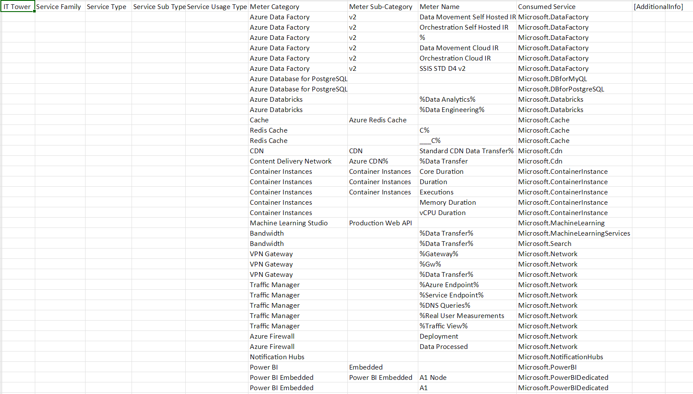

# Аналитическая работа №2 - Знакомство с облачными сервисами Microsoft Azure
## Состав команды: 
- Улитина Мария;
- Бакланова Анастасия;
- Крылов Дан;
- Борисов Игнат.
## Цель работы: 
 Знакомство с облачными сервисами. Понимание уровней абстракции над инфраструктурой в облаке. Формирование понимания типов потребления сервисов в сервисной-модели.
## Дано: 
1. Слепок данных биллинга от провайдера после небольшой обработки в виде SQL-параметров. Символ % в начале/конце означает, что перед/после него может стоять любой набор символов.
2. Google с документациями провайдера.
## Необходимо: 
1. Импортировать файл .csv в Excel или любую другую программу работы с таблицами;
2. Определить соответствие каждого сервиса международного провайдера русскому сервису.
## Начальные данные: 

 После анализа слепка данных, и изучив сервисы Microsoft Azure, были подобраны аналоги среди сервисов Yandex Cloud и VK Cloud. Были выбранны данные облачные сервисы, поскольку они являются самыми популярными в использовании на российском рынке. 
 Конечно, сервисы Microsoft являются разнообразнее и имеют более широкий функционал в отличие от российских аналогов, однако это не помешало подобрать к каждому из исходного списка аналог из Yandex Cloud и VK Cloud.
## Cервисы Microsoft Azure и их аналоги среди Yandex Cloud Service и VK Cloud Service:

**Azure Data Factory** - это облачная служба ETL Azure для масштабируемой бессерверной интеграции и преобразования данных.  Визуально интегрирует источники данных с помощью более чем 90 встроенных, не требующих обслуживания разъемов без дополнительных затрат. Он предлагает пользовательский интерфейс без кода для интуитивно понятного создания, а также мониторинга и управления с единой панели. Также можно перенести существующие пакеты SSIS в Azure и запустить их с полной совместимостью в ADF. Среда выполнения интеграции SSIS предлагает полностью управляемую услугу, поэтому не придется беспокоиться об управлении инфраструктурой.

##

**Azure Database for PostgreSQL** - это служба реляционной базы данных, основанная на ядре базы данных Postgres с открытым исходным кодом. Это полностью управляемая база данных как услуга, которая может обрабатывать критически важные рабочие нагрузки с предсказуемой производительностью, безопасностью, высокой доступностью и динамической масштабируемостью.

##

**Azure Databricks** - это унифицированная открытая аналитическая платформа для создания, развертывания, совместного использования и обслуживания данных, аналитики и решений искусственного интеллекта корпоративного уровня в любом масштабе. Платформа обработки данных Databricks интегрируется с облачным хранилищем и безопасностью вашей облачной учетной записи, а также управляет и развертывает облачную инфраструктуру от вашего имени.

##
**Cache**- это аппаратный или программный компонент, который хранит данные, чтобы будущие запросы на эти данные могли обслуживаться быстрее; данные, хранящиеся в кэше, могут быть результатом более ранних вычислений или копией данных, хранящихся в другом месте. 
Попадания в кэш обслуживаются путем чтения данных из кэша, что происходит быстрее, чем повторное вычисление результата или чтение из более медленного хранилища данных; таким образом, чем больше запросов может быть обработано из кеша, тем быстрее работает система.

##
**Redis Cache** - это хранилище структур данных в памяти с открытым исходным кодом (лицензия BSD), используемое в качестве базы данных, кэша, брокера сообщений и механизма потоковой передачи. Redis предоставляет такие структуры данных , как строки , хеши , списки , наборы , отсортированные наборы с запросами диапазона, растровые изображения , гиперлоги , геопространственные индексы и потоки . Redis имеет встроенную репликацию , сценарии Lua , вытеснение LRU , транзакции и различные уровни сохранения на дискЕ. 

##
**CDN (Content Delivery Network)** - это географически распределенная группа серверов, которые кэшируют контент рядом с конечными пользователями. CDN позволяет быстро передавать ресурсы, необходимые для загрузки интернет-контента, включая HTML-страницы, файлы JavaScript, таблицы стилей, изображения и видео.
##

**Container Instances** - это служба, которая позволяет разработчику развертывать контейнеры в общедоступном облаке Microsoft Azure без необходимости подготовки какой-либо базовой инфраструктуры или управления ею.
Служба поддерживает как контейнеры Linux, так и контейнеры Windows. Это избавляет разработчика от необходимости предоставлять виртуальные машины ( ВМ ) или внедрять платформу оркестрации контейнеров, такую ​​как Kubernetes , для развертывания и запуска контейнеров. Вместо этого с помощью ACI организация может развернуть новый контейнер через портал Azure или интерфейс командной строки ( CLI ), а Microsoft автоматически подготавливает и масштабирует базовые вычислительные ресурсы. ACI также поддерживает стандартные образы Docker , которые разработчик может получить из реестра контейнеров, например Docker Hub или реестра контейнеров Azure.
##

**Machine Learning Studio** - это инструмент для совместной работы с возможностью перетаскивания, который можно использовать для создания, тестирования и развертывания решений прогнозного анализа ваших данных. Machine Learning Studio публикует модели в виде веб-сервисов, которые можно легко использовать с помощью пользовательских приложений или инструментов бизнес-аналитики, таких как Excel.
##

**Bandwidth** - это объем данных, которые передаются в ваши ресурсы Azure и из них. Затраты на пропускную способность могут составлять значительную часть вашего общего счета за Azure, но их часто упускают из виду. Под пропускной способностью понимают перемещение данных в центры обработки данных Azure и из них, а также перемещение данных между центрами обработки данных Azure; другие передачи явно покрываются сетью доставки контента, ценами ExpressRoute или пирингом.
##

**VPN Gateway** - это служба, которая использует определенный тип шлюза виртуальной сети для отправки зашифрованного трафика между виртуальной сетью Azure и локальными расположениями через общедоступный Интернет. Вы также можете использовать VPN-шлюз для отправки зашифрованного трафика между виртуальными сетями Azure через сеть Microsoft. К одному и тому же VPN-шлюзу можно создать несколько подключений. При создании нескольких подключений все VPN-туннели совместно используют доступную пропускную способность шлюза.

 
##
**Traffic Manager** - это балансировщик нагрузки трафика на основе DNS. Эта служба позволяет распределять трафик общедоступных приложений по глобальным регионам Azure. Диспетчер трафика также обеспечивает вашим общедоступным конечным точкам высокую доступность и быстроту реагирования.
Диспетчер трафика использует DNS для направления клиентских запросов к соответствующей конечной точке службы на основе метода маршрутизации трафика. Диспетчер трафика также обеспечивает мониторинг работоспособности каждой конечной точки.
##

**Azure Firewall** - это облачная интеллектуальная служба безопасности сетевого брандмауэра, которая обеспечивает лучшую в своем классе защиту от угроз для ваших облачных рабочих нагрузок, выполняемых в Azure. Это межсетевой экран с полным сохранением состояния как услуга со встроенными функциями высокой доступности и неограниченной облачной масштабируемостью. Он обеспечивает проверку дорожного движения как с востока на запад, так и с севера на юг.

**Notification Hubs** предоставляют простой в использовании и масштабируемый механизм push-уведомлений, который позволяет отправлять уведомления на любую платформу (iOS, Android, Windows и т. д.) из любой серверной части (облако или локально). Центры уведомлений отлично подходят как для корпоративных, так и для потребительских сценариев. 

##
**Power BI** - это единое решение для самообслуживания и корпоративной аналитики. Он позволяет вам визуализировать ваши данные, делиться ими со всей вашей организацией и встраивать их в свое приложение или на веб-сайт. Azure Analytics и Power BI вместе предоставляют ценную информацию в масштабе, позволяя вам развивать культуру, основанную на данных, необходимую для процветания в быстро меняющейся конкурентной среде.

##
**Power BI Embedded** позволяет встраивать элементы Power BI, такие как отчеты, информационные панели и плитки, в веб-приложение или на веб-сайт. С его помощью можно: Предоставлять конечным пользователям привлекательные возможности обработки данных, позволяя им принимать меры на основе данных ваших решений и
быстро и легко создавайте исключительные отчеты, информационные панели и аналитику для клиентов в своих собственных приложениях, используя Power BI и называя его своим собственным.

##
